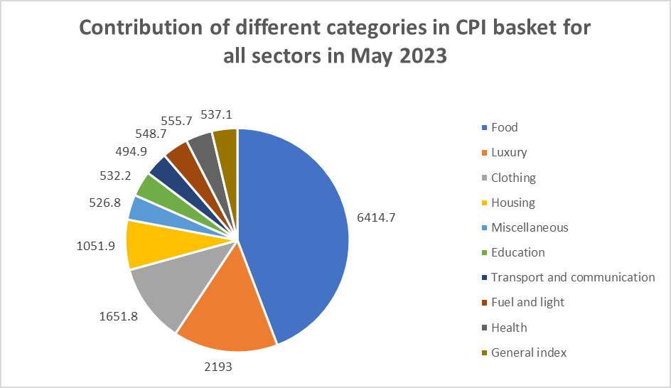
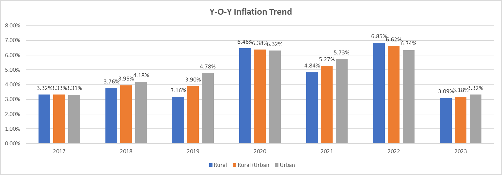
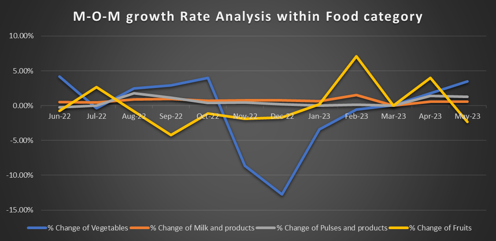
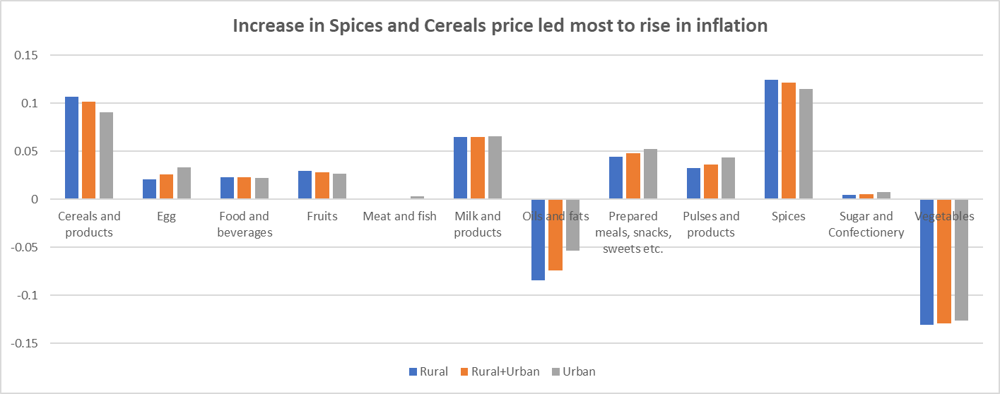
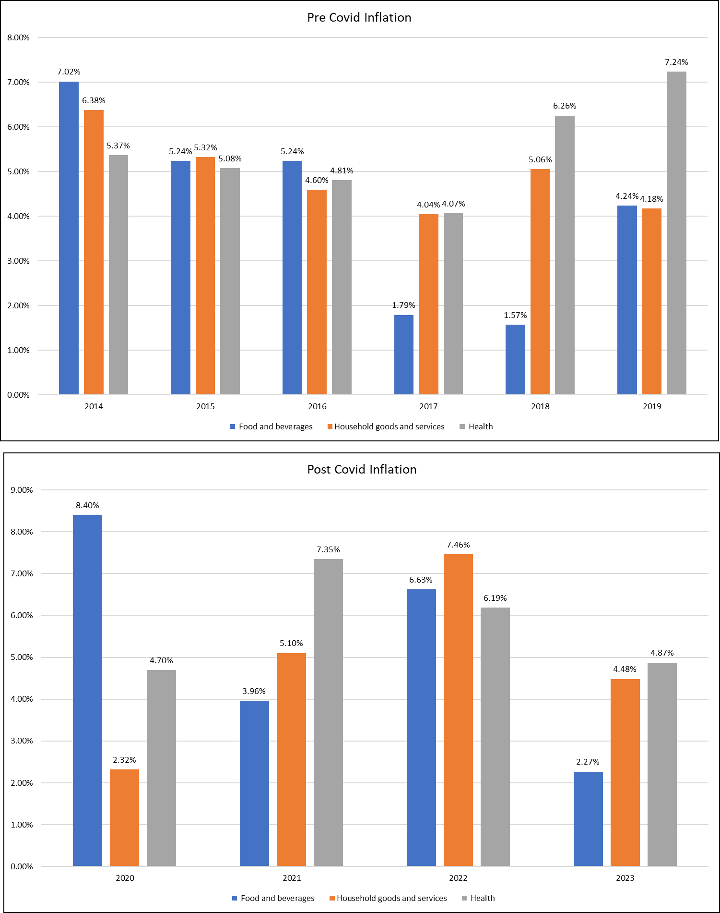
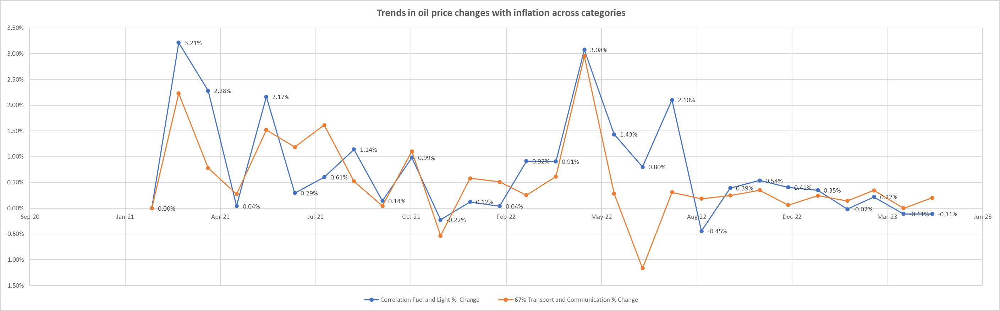

# CPI Inflation Analysis — India | Uncovering a decade of inflation trends across sectors using Excel


## 📌 Overview

India's Consumer Price Index (CPI) is the key metric used to track inflation and guide monetary policy. This project analyzes over a decade of CPI data across Rural, Urban, and Combined sectors to understand which categories drive inflation, how it has evolved year-over-year, and how external shocks like COVID-19 and oil price swings have shaped the numbers.

## 📊 Dataset

- **Source:** All India Consumer Price Index data, published by the Ministry of Statistics and Programme Implementation (MoSPI), Government of India
- **Size:** 27 sub-categories × 3 sectors (Rural, Urban, Rural+Urban) × 124 months, 372 rows
- **Period covered:** January 2013 – May 2023

## 🛠️ Tools & Techniques

- **Tool:** Excel
- **Key techniques:** Pivot Tables, VLOOKUP/INDEX-MATCH, conditional formatting, the `CORREL` function, interactive dashboards

## 🔍 Approach

1. Cleaned the raw MoSPI index data, handling missing values (e.g. `NA` entries in the Housing category for early years) and verifying consistency across sectors.
2. Built pivot tables to compute each broader category's (Food, Clothing, Housing, Health, etc.) contribution to the overall CPI basket as of May 2023.
3. Calculated Year-over-Year inflation trends for Rural, Urban, and Combined sectors from 2017–2023 to identify the highest-inflation year.
4. Analyzed month-on-month food inflation (Vegetables, Milk, Pulses, Fruits) from June 2022–May 2023, and compared pre- vs. post-COVID annual inflation (2014–2023) across Food, Household, and Health categories.
5. Used the `CORREL` function to quantify the relationship between Fuel & Light and Transport & Communication inflation as a proxy for oil price pass-through.
6. Consolidated all findings into an interactive dashboard with a summary recommendation.

## 💡 Key Insights

- **Food & Beverages contributed ~44% of the overall CPI basket** (6,414.7 of 14,506.8 total index points) — the highest of any broader category, meaning food prices have an outsized effect on India's headline inflation number.
- **2022 was the peak Y-o-Y inflation year**, with Rural CPI rising 6.85% and Rural+Urban CPI rising 6.62% — the highest of any year from 2017–2023, narrowly ahead of 2020 (6.46%/6.38%).
- **Food inflation nearly doubled in 2020 (8.40%) vs. 2019 (4.24%)** following COVID-19's first lockdown, while Health inflation counterintuitively fell from 7.24% (2019) to 4.70% (2020).
- **Spices and Cereals drove the largest sustained price increases** (~10–12%) across the food basket, while Oils & Fats and Vegetables saw net declines (as low as −13%) over the same period.
- **Fruits spiked over +7% month-on-month in February 2023**, the sharpest single jump in the food basket, while Vegetables were the most volatile overall — swinging as low as ~−12% around Nov–Dec 2022.
- **Found a 0.67 correlation between Fuel & Light and Transport & Communication inflation**, with both series tracking closely together from late 2020 through mid-2023 — confirming oil price movements pass through meaningfully into transport costs.

## 📷 Dashboard Preview

**Contribution of categories in the CPI basket (May 2023)**


**Year-over-Year inflation trend by sector (2017–2023)**


**Month-on-month growth rate within the Food category**


**Which sub-categories drove the rise in inflation**


**Pre- vs. post-COVID annual inflation comparison**


**Fuel & Light vs. Transport & Communication correlation trend**


## 📁 Repository Structure

```
├── README.md
├── data/
│   └── All_India_Index_Upto_April23.csv   # original raw MoSPI CPI dataset
├── images/
│   ├── cpi-basket-contribution.png
│   ├── yoy-inflation-trend.png
│   ├── mom-food-category-growth.png
│   ├── spices-cereals-inflation-drivers.png
│   ├── pre-post-covid-inflation.png
│   └── oil-price-correlation-trend.png
└── Cpi.xlsx                                # full analysis: pivot tables, 5 business questions, and dashboard
```

## ▶️ How to Reproduce

**Excel:** Open `Cpi.xlsx` and navigate through the `Question 1`–`Question 5` sheets to see each analysis step, or jump straight to the `Recommendation` sheet for the summary. The original raw data is included in `data/All_India_Index_Upto_April23.csv` for reference and reproducibility — it matches the `Raw Data` sheet inside the workbook.

## 👤 Author

**Shubham Kumar Gupta**
Data Analyst | [LinkedIn](https://www.linkedin.com/in/shubham-kumar-gupta-a4551b191) | [GitHub](https://github.com/shubamkumargupta-123)
